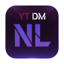

A browser extension that seamlessly integrates a private messaging system directly into the YouTube interface. Chat with other users without leaving the site.

## Installation

Install directly from the browser extension stores:

- [**Chrome Web Store**](https://chromewebstore.google.com/detail/youtube-direct-messages/dbkdcdmeokoneaoibbgclfafjikffibm)  
- [**Firefox Add‑ons**](https://addons.mozilla.org/en-US/firefox/addon/youtube-direct-messages/)

Installing from the stores enables automatic updates and simplifies installation.

Alternatively, to install manually from source:

1. Go to the [Releases page](https://github.com/sdwck/youtube-direct-messages/releases/latest) and download the ZIP archive of the latest release.  
2. Unzip the archive.  
3. Open your browser and navigate to `chrome://extensions`.
4. Enable **Developer mode** (usually toggle in the top right).
5. Click **Load unpacked**, then select the `yt-dm-nl` folder you just unzipped.  
6. The YouTube DM icon will now appear in the top right corner of the YouTube header.

## Build

If you’d like to build the extension yourself:

```bash
git clone https://github.com/sdwck/youtube-direct-messages.git
cd youtube-direct-messages
npm install
npm run build
```

## Features

- **Direct Messaging:** Chat one-on-one with any other user of the extension.
- **Real-time & Secure:** Built on Firebase Firestore for fast, reliable, and secure message delivery.
- **YouTube Integration:** The chat panel is designed to feel like a native part of the YouTube UI.
- **Rich Media Sharing:** Share links to YouTube videos, which are automatically converted into beautiful, clickable previews.
- **Shareable Profile Links:** Easily invite others to chat by sharing a unique link.
- **Unread Message Notifications:** A subtle dot on the DM icon lets you know when you have new messages.
- **Lazy Loading:** Message history is loaded in batches for optimal performance, even in long conversations.

## Tech Stack

- **TypeScript**
- **Firebase** (Firestore & Auth)
- **Webpack**

## How to Use

- **Login:** Click the DM icon and sign in with your Google account.
- **Start a Chat:** Get a user's unique ID (UID) and start a new conversation. You can get your own UID by clicking "Copy My Link" and examining the URL.
- **Share:** Use the "DM" option in YouTube's native "Share" menu to send videos directly to your contacts.

---
